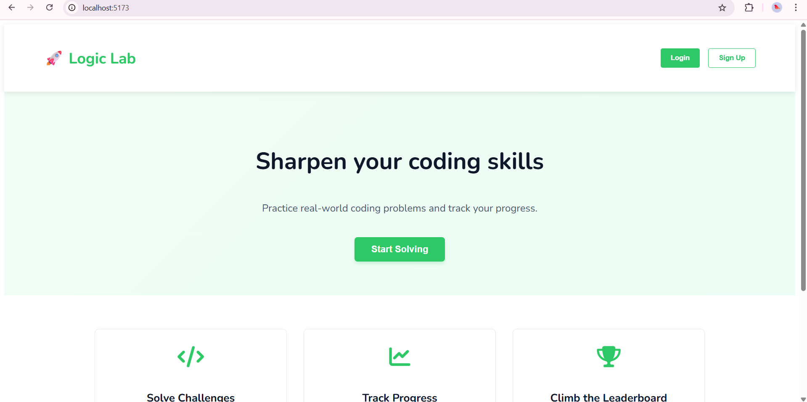
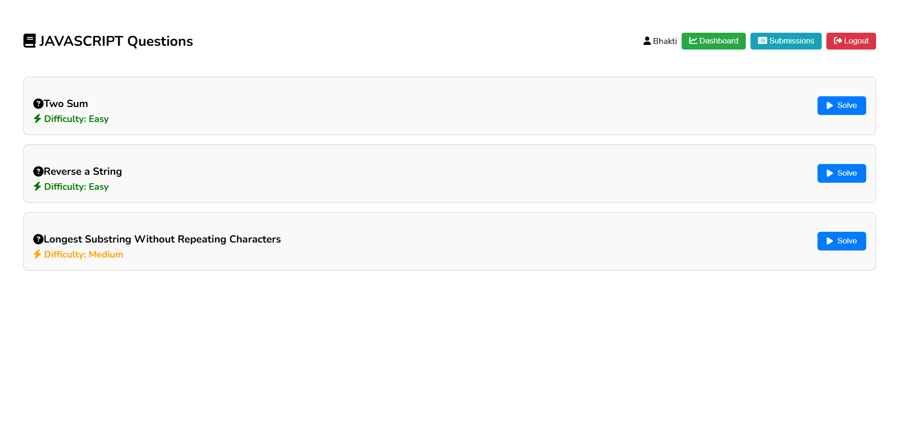
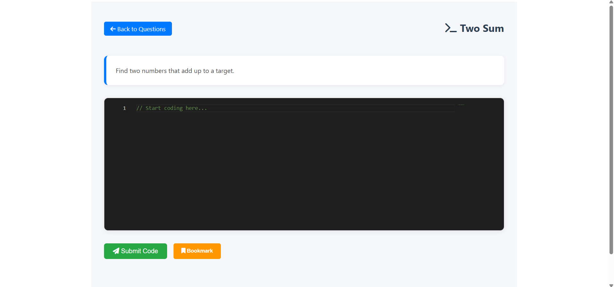

# 🧠 Logic Lab

A modern HackerRank-style coding platform clone built using **React + Vite**.  
Logic Lab includes login/signup flows, dashboard, question lists, bookmarking, and code solving pages – all styled with clean, custom CSS.

---

## 🚀 Features

- 🔐 **Login & Signup** using React Router
- 🧑‍💻 **Dashboard** for user stats and subjects
- 📄 **Question List** page
- ✏️ **Solve Page** for individual problems
- 📌 **Bookmarks Page** to view saved questions
- 🏆 **Leaderboard Page** (UI Ready)
- 🌗 **Dark/Light Mode** toggle
- 💬 Toast notifications for user feedback
- 🎨 Fully responsive custom CSS styling

---

## 🗂️ Project Structure

```

logic\_lab/
├── backend/                  # Node.js + MySQL backend (auth system)
├── src/
│   ├── components/
│   │   ├── Login.jsx
│   │   ├── Signup.jsx
│   │   ├── Dashboard.jsx
│   │   ├── QuestionList.jsx
│   │   ├── SolvePage.jsx
│   │   ├── Bookmarks.jsx
│   │   ├── Leaderboard.jsx
│   │   ├── styles/
│   │   │   ├── Auth.css
│   │   │   ├── Dashboard.css
│   │   │   ├── QuestionList.css
│   │   │   └── SolvePage.css
│   ├── App.jsx
│   ├── main.jsx
│   └── index.css
├── public/
│   └── index.html
└── README.md

````

---

## 📸 Screenshots

| Landing Page | Dashboard | Question Page | Solve Page |
|--------------|-----------|----------------|-------------|
|  |  |  |  |


---

## ⚙️ Tech Stack

- [React](https://reactjs.org/)
- [Vite](https://vitejs.dev/)
- [React Router](https://reactrouter.com/)
- [Font Awesome](https://cdnjs.com/libraries/font-awesome)
- [Node.js](https://nodejs.org/) & [MySQL](https://www.mysql.com/) *(backend for auth)*
- Toast Notifications via `react-hot-toast`
- Fully responsive **plain CSS** (no Bootstrap)

---

## 🔧 Setup Instructions

```bash
# 1. Clone the repo
git clone https://github.com/bhaktikarche/logic-lab.git
cd logic-lab

# 2. Install frontend dependencies
npm install

# 3. Start the React development server
npm run dev
````

> 🗒️ For backend setup, refer to `/backend/README.md` (coming soon)

---

## 📌 License

This project is built for learning and educational purposes.

---

